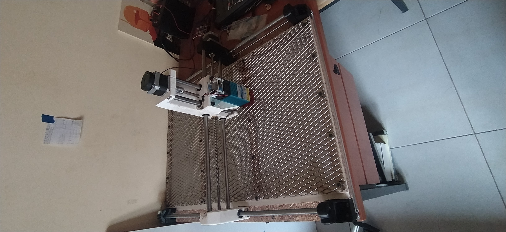

# CNC Láser DIY basado en diseño de Nikodem Bartnik

---

## Descripción

Este proyecto consiste en el diseño, construcción y puesta en marcha de una **máquina CNC láser de escritorio**, basada en el diseño open-source desarrollado por Nikodem Bartnik.

El objetivo principal fue replicar y adaptar una arquitectura CNC de bajo costo, incorporando un módulo láser para realizar tareas de **grabado y corte de materiales livianos**, priorizando precisión, repetibilidad y facilidad de construcción.

---

## Características Principales

- **Arquitectura tipo pórtico (Gantry)**
  - Movimiento en ejes X-Y mediante guías lineales
  - Estructura rígida basada en perfiles de aluminio y piezas impresas en 3D

- **Control CNC**
  - Control mediante firmware GRBL sobre microcontrolador Arduino
  - Ejecución de trayectorias a través de G-code

- **Cabezal Láser**
  - Módulo láser de diodo para grabado y corte
  - Sistema sin contacto (sin fuerzas mecánicas sobre la pieza)

- **Precisión y repetibilidad**
  - Sistema de transmisión mediante husillos o correas
  - Movimiento controlado por motores paso a paso

---

## Principio de Funcionamiento

El sistema CNC interpreta instrucciones en **G-code**, generadas a partir de diseños CAD/CAM, para controlar el movimiento del cabezal láser sobre la pieza. 

El láser concentra energía en un punto focal muy pequeño, permitiendo **fundir o quemar** de forma precisa.

El proceso general es:

1. Diseño de la pieza (CAD)
2. Generación de trayectorias (CAM)
3. Conversión a G-code
4. Ejecución mediante GRBL
5. Movimiento coordinado de ejes + activación del láser

---

## Hardware Utilizado

- **Microcontrolador:** Arduino Uno   
- **Firmware:** GRBL  
- **Drivers:** DRV8825  
- **Motores:** NEMA 17 (paso a paso)  
- **Estructura:**
  - Perfiles de aluminio
  - Piezas impresas en 3D  
- **Sistema de movimiento:**
  - Varillas lisas + rodamientos lineales o ruedas V-slot  
  - Husillos o correas GT2  
- **Módulo láser:** Diodo (2W)

---

## Software

- **GRBL** → Control de movimiento CNC  
- **CNCjs / Universal Gcode Sender** → Envío de G-code  
- **Software CAM:**
  - LaserGRBL
  - LightBurn
  - Inkscape (para generación de vectores)

---

## Desafíos Técnicos

- **Rigidez estructural**
  - Crítica para evitar vibraciones y pérdida de precisión

- **Calibración de pasos/mm**
  - Necesaria para exactitud dimensional

- **Alineación del láser**
  - Impacta directamente en la calidad del grabado

- **Gestión térmica**
  - Disipación del módulo láser

---

## Resultados

- Grabado preciso en materiales como:
  - Madera
  - MDF
  - Acrílico (limitado)

- Alta repetibilidad en trayectorias
- Funcionamiento estable con bajo costo de implementación

---

## Posibles Mejoras

- Implementación de eje Z automático
- Control de potencia láser por PWM más fino
- Sistema de extracción de humos
- Estructura más rígida (aluminio mecanizado)

---

## Aplicaciones

- Grabado personalizado
- Prototipado rápido
- Fabricación de piezas livianas
- Electrónica (marcado de placas, carcasas)

---

## Conclusión

Este proyecto demuestra que es posible construir una **máquina CNC láser funcional y precisa con recursos accesibles**, integrando conceptos de mecánica, electrónica y control.

Además, permite comprender en profundidad el funcionamiento de sistemas CNC reales, desde la generación de trayectorias hasta la ejecución física del proceso.
